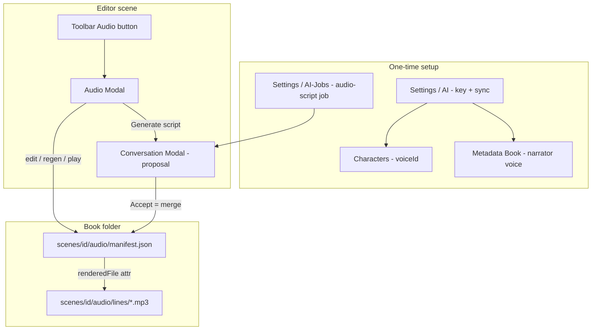

# Scene Audio Drama — Understanding

## User journey (plain English)

One-time setup, then the loop for each scene.

### One-time setup (what you see + what gets called)

| Step | UI you are looking at | What you do | Endpoints |
|---|---|---|---|
| 1 | **Settings → AI** (`/settings/ai`) — new “ElevenLabs” section below the models table | Optionally paste an API key. If left empty, the backend uses the env var `ELEVENLABS_API_KEY`. Click **Sync voice library**. | `GET /api/settings/elevenlabs` (masked key), `PATCH /api/settings/elevenlabs` (optional key), `POST /api/settings/elevenlabs/voices/sync`, then `GET /api/settings/elevenlabs/voices` (cached list) |
| 2 | **Settings → AI-Jobs** (`/settings/ai-jobs`) → Job modal | Create a job with output type **audio-script** and a directing prompt that uses `@current_scene`, `@scene_speakers`, `@existing_audio_script`. | Existing AI-Jobs CRUD: `GET/POST/PATCH /api/settings/ai-jobs` |
| 3 | **Characters** (`/book/:bookId/characters`) — each character’s edit row | Pick a voice in the Voice dropdown (searchable). Optional preview / Suggest voice. Save. | `GET /api/settings/elevenlabs/voices`, `POST /api/books/{b}/characters/{id}/voice/suggest`, `PATCH /api/books/{b}/characters/{id}` (`voiceId`, `voiceName`) |
| 4 | **Metadata → Book** (`/book/:bookId/metadata`, Book tab) | Pick Narrator voice. Save. Also: **Git ignore** patterns (includes `*.mp3` by default) so audio binaries never enter the book’s git history. | Voices GET; `PATCH /api/books/{b}` (narrator fields); `GET/PUT /api/books/{b}/gitignore` |

**Key resolution rule:** stored `elevenLabsApiKey` may be empty, a literal key, or `${ELEVENLABS_API_KEY}`. At call time, `resolve_secret(raw, default_env="ELEVENLABS_API_KEY")` — empty/`None` falls back to the env var. UI key is optional when the env is already set.

### Placeholders status (today vs this feature)

Resolution lives in [`placeholder_registry.py`](src/backend/app/services/placeholder_registry.py) (`PlaceholderRegistry.resolve`). AI-Job save validation uses the same registry (`unknown_tokens`).

| Token | Defined today? | Resolved today? | Notes |
|---|---|---|---|
| `@current_scene` | Yes | Yes | Full scene prose via `mgr.read_scene_content` |
| `@scene_speakers` | **No** | **No** | Must add to `_REGISTRY` + `replacements` — scene tagged characters as `speaker_id "chr-…" — Name` plus narrator |
| `@existing_audio_script` | **No** | **No** | Must add — dump `manifest.json` or `"(none — first generation)"` via `audio_service.read_manifest_if_exists` |

Until those two are implemented, saving an AI-Job prompt that mentions them will fail validation (`unknown_tokens`), and even if forced through, `resolve` would leave the tokens as literal `@scene_speakers` / `@existing_audio_script` in the model prompt.

Related but different: `@scene_characters` already exists (full character sheets for tagged characters) — **not** a substitute for `@scene_speakers` (ids-only casting list, no voice data).

---

### First time you turn a scene into audio

5. Finish the scene in the **Editor**. Tag speaking characters via Scene Modal → Characters (metadata popup — unchanged; Audio does **not** live there).
6. In the **Editor toolbar**, click **Audio** → opens the **Audio Modal** (separate modal, not the metadata Scene Modal).
7. If no script yet: **Generate script** runs the audio-script AI-Job → opens the existing Conversation Modal.
8. Review the proposal card (line table + new/regenerate/unchanged badges) → **Accept**. Backend merges with any prior manifest, writes `manifest.json`, attaches real voice IDs from Character Sheet / Narrator.
9. Back in Audio Modal: click **Generate all pending** (or generate as you go). Paid ElevenLabs step for lines marked `new`/`regenerate`.
10. Click **Play scene** — browser plays each line mp3 in order with pauses between (playlist). Or play one line at a time.

### After you edit prose later

11. Edit scene prose as usual.
12. From Audio Modal (or AI-Jobs menu), re-run the audio-script job. AI returns a proposed script with statuses.
13. **Accept** → server **diff-and-merge**: unchanged lines keep old text, voice_settings, and `renderedFile` (existing mp3 stays linked). New/regenerate lines get new text/settings and clear or mark for re-synth.
14. Generate only pending lines → Play scene again.

---

## What this feature is

Two halves:

1. **Script generation (AI)** — AI-Job → conversation → proposal → Accept. Accept is a **merge** into `manifest.json`, not a blind overwrite.
2. **Synthesis + listen (ElevenLabs + browser)** — Audio Modal edits the saved script, regenerates per line or in batch, and plays lines as a playlist. FastAPI only serves static mp3 files; no separate streaming server.

Voice casting stays on Character Sheet / book Narrator. On Accept, server overwrites `speakers` voice ids from those assignments.

Hard rules: never write scene `.md`; store under `scenes/{id}/audio/`; single writer; voice library in `app.json`.



---

## Audio Modal (separate from Scene Modal)

**Entry:** Editor page toolbar — **Audio** button on the scene you are writing. Opens `AudioModal` (new component). Does **not** add a tab to the metadata Scene Modal (Basics / Characters / Summary).

**Layout (one composition):**

- Header: scene title, revision, synthesis status, actions: **Generate script** | **Generate all pending** | **Play scene** | **Stop** | Delete audio (trash)
- Body: scrollable list of sequence items (the “JSON rendered as UI”), not a raw JSON dump
- Each row:
  - Speaker name (from `speakers` / character resolve)
  - Type badge: dialogue / narration / sfx
  - Editable **text** (textarea — includes v3 tags)
  - **Stability** slider (0–1) + similarity_boost if shown
  - `generation_status` badge
  - If `renderedFile` set: small **Play** control (`<audio src={lineUrl}>`)
  - If missing or stale: “no audio yet”
  - **Regenerate** button — synthesizes **this line only**
  - Save row / autosave on blur for text + slider edits

### UI → API behaviour

| Author action | API | Backend behaviour |
|---|---|---|
| Open modal | `GET /api/books/{b}/scenes/{s}/audio` | Return manifest or 404 (empty state: “Generate script”) |
| Generate script | Existing `POST .../ai-jobs/run` + Conversation Modal | Proposal `audio-script-create`; Accept merges (below) |
| Edit text / stability | `PATCH /api/books/{b}/scenes/{s}/audio/lines/{itemId}` | Update fields on that sequence item; if text or voice_settings changed vs last synthesized content, set `generation_status=regenerate` and keep old `renderedFile` until regen succeeds (play still works for old take) |
| Regenerate one line | `POST .../audio/lines/{itemId}/generate` | Enqueue single-line synth; SSE `audio-progress`; on success set `renderedFile`, `generation_status=unchanged` |
| Generate all pending | `POST .../audio/generate` | Worker synthesizes all `new`/`regenerate`; same SSE |
| Play one line | Browser `GET .../audio/lines/{filename}` | `FileResponse` `audio/mpeg` (static file) |
| Play scene | **Client only** — no special stream API | Playlist player (below) |
| Delete all audio | `DELETE .../audio` | Move folder to `.trash/` |

Optional later: `PATCH .../audio` for bulk reorder — not required for v1 if rows are edited one-by-one.

---

## Data source: where mp3s live and how they link

**On disk (inside the book folder):**

```
scenes/{sceneId}/audio/
  manifest.json          # script + status + links
  lines/
    001-narrator-a1b2c3.mp3
    002-chr-4e9a02-d4e5f6.mp3
    ...
  scene_stitched.mp3     # optional artifact from batch stitch; not required for Play scene
```

**Linking:** each sequence item in `manifest.json` carries:

```json
{
  "id": "a1b2c3",
  "type": "dialogue",
  "speaker_id": "chr-4e9a02",
  "text": "[nervously] Susan?",
  "voice_settings": { "stability": 0.5, "similarity_boost": 0.75 },
  "generation_status": "unchanged",
  "renderedFile": "002-chr-4e9a02-a1b2c3.mp3"
}
```

- **`renderedFile`** is the attribute that links JSON → mp3 (filename only, under `lines/`).
- Lookup URL: `GET /api/books/{b}/scenes/{s}/audio/lines/{renderedFile}`.
- Filename includes stable **item `id`** so UPDATE MODE / reorder does not lose the link; position prefix is cosmetic.
- No separate DB index — the manifest is the source of truth (JSON-only persistence + binary beside it, same pattern as `resources/`).
- **Git:** `*.mp3` is ignored; `manifest.json` is tracked. See “Git: mp3s stay out of the book repo”.

---

## Merge on Accept (diff and apply)

When the AI returns a new script and the author Accepts:

1. Parse proposal → candidate manifest.
2. Load existing `manifest.json` if any.
3. Assemble authoritative `speakers` from Character Sheet + Narrator (overwrite model voice ids).
4. **Merge sequence by item `id`:**
   - Status **`unchanged`**: keep the **old** item verbatim (text, voice_settings, `renderedFile`, duration fields). Ignore model echo. Mp3 stays valid — no regen needed.
   - Status **`regenerate`**: take new text/voice_settings from the proposal; **keep** old `renderedFile` until synth replaces it (so Play still works); set status `regenerate`.
   - Status **`new`**: insert new item; `renderedFile=null`.
   - Ids in `notes.removed_ids` (or missing from new sequence): drop from sequence; old mp3s left on disk until trash/cleanup (or delete those files on accept — prefer delete-to-trash for removed ids to avoid orphans).
5. Validate every non-sfx `speaker_id` has a non-empty `voice_id`.
6. Atomic write `manifest.json`.

This is the cost-control path: Accept never calls ElevenLabs; Generate only touches `new`/`regenerate`.

---

## Playback: Play scene (playlist) — no streaming server

**Decision:** FastAPI/Starlette `FileResponse` is enough. Same pattern as resource file download. No HLS, no WebRTC, no separate media server.

- Each line is a complete mp3 on disk.
- Browser requests one URL at a time; Starlette supports HTTP Range for seek/scrub if needed.
- **Play scene** is implemented **entirely in the frontend**:

```text
playlist = manifest.sequence.filter(has renderedFile)
i = 0
play(i):
  audio.src = lineUrl(playlist[i].renderedFile)
  audio.play()
on ended:
  wait gapMs(prev, next)   // same constants as stitch: DEFAULT / SPEAKER_CHANGE / SFX
  i++
  if i < length: play(i)
```

Gap timing ports `speech_generator.py`: `DEFAULT_GAP_MS`, `SPEAKER_CHANGE_GAP_MS`, `SFX_GAP_MS` — shared as a small constant module or duplicated once in the frontend playlist helper so Play scene feels like the stitched file without requiring stitch for listening.

**Stitched file** (`POST generate` still may stitch + `GET .../stitched`) remains available as a single-file export/download, but **Play scene does not depend on it**.

**Why not server-side streaming of concatenated audio?** Unnecessary complexity; playlist gives per-line scrub, regenerate-one-and-replay, and pause-between-speakers without re-encoding.

---

## Git: mp3s stay out of the book repo

Audio binaries are local/derived artifacts (regenerable via ElevenLabs). They must **not** be committed with the book.

### Defaults

- **New books:** `BookService` scaffold writes `.gitignore` as:

```
*.tmp
*.mp3
```

(today it only writes `*.tmp` — extend that.)

- **Existing books:** on first open after this feature (or first Audio Modal open), `ensure_gitignore_patterns(book_dir, ["*.mp3"])` appends any missing required patterns atomically — does not wipe author-added lines.

- **Manifest stays in git:** `scenes/{id}/audio/manifest.json` is text/JSON and **is** committed (script + `renderedFile` names). Only `*.mp3` is ignored. After clone, author re-runs Generate for missing files.

### Book settings UI — gitignore editor

On **Metadata → Book** (same tab as story summary / narrator voice):

- Section **Git ignore** — multiline textarea (one pattern per line), loaded from the book’s root `.gitignore`.
- Save writes via API (not a second copy in `book.json` — **source of truth is the file** `.gitignore`, same as today).
- Helper text: “`*.mp3` keeps generated audio out of git. `manifest.json` is still tracked.”

### API

| Method | Path | Behaviour |
|---|---|---|
| `GET` | `/api/books/{b}/gitignore` | `{ "patterns": ["*.tmp", "*.mp3", ...] }` parsed from `.gitignore` (empty file → `[]`) |
| `PUT` | `/api/books/{b}/gitignore` | `{ "patterns": string[] }` → normalize, ensure required defaults (`*.tmp`, `*.mp3`) are present unless author explicitly removed… **Decision: always re-inject `*.mp3` and `*.tmp` on save if missing** so audio cannot be accidentally committed by clearing the field. Author may add more patterns freely. Atomic write to `{book}/.gitignore`, then `notify_changed` so git-status badge updates. |

Repo-root Authority `.gitignore` is unrelated (app build artifacts). This is **per-book** only.

### Note on already-tracked files

`.gitignore` only affects untracked files. If an mp3 was committed before the pattern existed, the author must untrack once via Git page / `git rm --cached` — out of scope for auto-fix in v1; document in helper text if useful.

---

## Frontend pages that change

| Page / surface | Why | How |
|---|---|---|
| **Settings → AI** | Optional key override + voice library sync | ElevenLabs section; env `ELEVENLABS_API_KEY` is default when key empty |
| **Settings → AI-Jobs** | Author defines audio-script job | Add `audio-script` output type in JobModal |
| **Characters** | Cast voices | SearchableSelect + preview + Suggest |
| **Metadata → Book** | Narrator voice + **gitignore settings** | Voice picker; Git ignore textarea (`GET/PUT .../gitignore`); defaults include `*.mp3` |
| **Editor** | Entry to Audio on the scene itself | Toolbar **Audio** button opens Audio Modal |
| **Audio Modal** (new) | Edit script, regen lines, playlist play | `features/audio/AudioModal.tsx` + hooks; NOT a Scene Modal tab |
| **Conversation Modal** | Review AI script before merge | `audio-script-create` proposal card (status badges) |

Unchanged as pages: Bookshelf, Graph, Table, Tasks, Resources, Git, User Settings, Scene Modal (metadata only).

Shared: `useBookEvents` handles `audio-progress`; `api/audio.ts`, `queries/audio.ts`, `keys.audio`.

---

## Backend systems — used, changed, why

### Key resolution

`resolve_secret(raw, default_env="ELEVENLABS_API_KEY")` — **changed from original spec’s `default_env=None`**. Empty app setting → env. Explicit UI key still wins when set.

### Extended

| System | Change |
|---|---|
| Character / book models | `voiceId`/`voiceName`; narrator fields |
| BookService scaffold | `.gitignore` seeds `*.tmp` + `*.mp3` |
| BookService / books API | `GET/PUT /gitignore`; `ensure_gitignore_patterns` for existing books |
| SettingsService | ElevenLabs key (optional) + voice cache + sync |
| Placeholders | `@scene_speakers`, `@existing_audio_script` |
| AiJob / parsers / ConversationService | `audio_script` output → proposal |
| ProposalService | Accept → **merge** via `AudioService.save_manifest` |
| EventHub | `audio-progress` SSE |

### New

| System | Role |
|---|---|
| `AudioService` | Paths, merge save, synthesize_line, optional stitch, FileResponse helpers |
| `AudioWorker` | Batch + single-line jobs from queue |
| Audio API | `GET/PATCH/DELETE` manifest & lines; `POST generate`; `POST lines/{id}/generate`; `GET lines/{file}`; `GET stitched` |
| Deps | `elevenlabs`, `pydub`; ffmpeg warning only |

---

## Recommended build order

1. Models + secrets with `ELEVENLABS_API_KEY` default
2. Book `.gitignore` defaults (`*.mp3`) + Metadata Book gitignore editor + ensure-on-open
3. Settings ElevenLabs + Characters/Book voice UI
4. AI-Job path + Accept merge
5. AudioService synth + worker + line/batch generate + FileResponse
6. Editor Audio Modal (edit, per-line play/regen, playlist Play scene)
7. Proposal card + SSE
8. Doc updates (BUILD-TODO Phase 12, docs 03/04/05)

---

## Bottom line

Setup is four screens (AI Settings, AI-Jobs, Characters, Metadata Book) with the endpoints listed above; env key works with no UI paste. **Mp3s are gitignored** (`*.mp3` in the book’s `.gitignore`, editable under Metadata → Book). Listening and editing happen in a **dedicated Editor Audio Modal**: manifest is the data source, each line’s `renderedFile` points at `scenes/{id}/audio/lines/*.mp3`, Accept **merges** so unchanged mp3s survive, and **Play scene** is a browser playlist over FastAPI static file responses — no separate streaming server.
